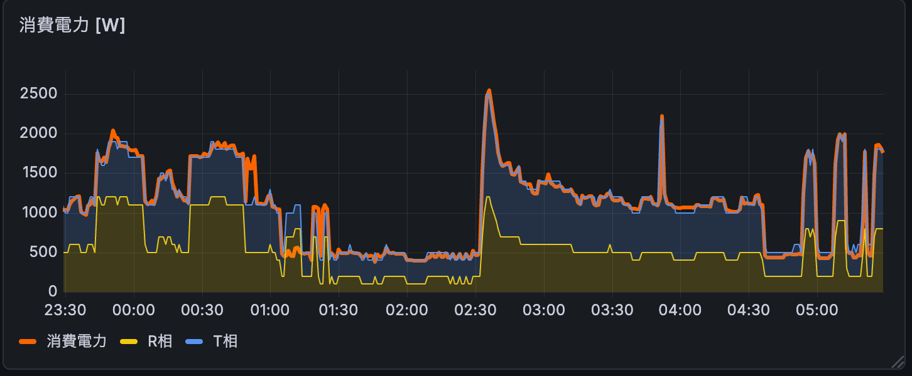

# smartmeter-exporter

ECHONET Lite スマートメーターから電力・電流データを取得し、[Prometheus](https://prometheus.io/) メトリクスとして公開するエクスポーターです。

## 概要

日本の家庭向けスマートメーターは、Wi-SUN 通信モジュールを介して B ルートサービス (ECHONET Lite) 経由で電力データを取得できます。このツールはその仕組みを利用し、Prometheus が収集できる形式でリアルタイムの電力・電流値を公開します。

Grafana などと組み合わせることで、自宅の電力消費を時系列で可視化・監視できます。

<p align="center">
  
</p>

## 機能

- 瞬時電力消費量（W）の取得
- R 相 / T 相の瞬時電流（A）の取得
- `/metrics` エンドポイントでの Prometheus 形式での公開
- 通信失敗時の自動再認証

## 必要なもの

### ハードウェア

- Wi-SUN 通信モジュール（USB 接続型）
  例: ROHM BP35A1、Tessera Technology RL7023 Stick-D/DSS など
- スマートメーターの B ルートサービス の申し込み（電力会社へ申請）

### ソフトウェア・環境

- Go 1.23 以上（バイナリビルドの場合）
- または Docker（コンテナ利用の場合）
- B ルート ID および B ルートパスワード（電力会社から発行）

## インストール

### Go でビルドする場合

```bash
git clone https://github.com/hnw/smartmeter-exporter.git
cd smartmeter-exporter
go build -o smartmeter-exporter .
```

クロスコンパイル（例: Raspberry Pi 向け Linux/ARM64）:

```bash
GOOS=linux GOARCH=arm64 CGO_ENABLED=0 go build -ldflags="-s -w" -o smartmeter-exporter .
```

### コンテナイメージを利用する場合

GitHub Container Registry からビルド済みイメージを取得できます（AMD64 / ARM64 / ARMv7 / ARMv6 対応）。

```bash
docker pull ghcr.io/hnw/smartmeter-exporter:latest
```

## 設定

環境変数またはコマンドラインフラグで設定します。フラグが環境変数より優先されます。

| 環境変数 | フラグ | デフォルト | 説明 |
|---|---|---|---|
| `SMARTMETER_ID` | `-id` | （必須）| B ルート ID |
| `SMARTMETER_PASSWORD` | `-password` | （必須）| B ルートパスワード |
| `SMARTMETER_DEVICE` | `-device` | `/dev/ttyACM0` | Wi-SUN モジュールのシリアルデバイスパス |
| `SMARTMETER_INTERVAL` | `-interval` | `60` | スクレイプ間隔（秒、最小 10） |
| `SMARTMETER_PORT` | `-port` | `9102` | HTTP リッスンポート |
| `SMARTMETER_CHANNEL` | `-channel` | `""` | Wi-SUN チャネル（指定するとスキャンをスキップ） |
| `SMARTMETER_IPADDR` | `-ipaddr` | `""` | スマートメーターの IPv6 アドレス（指定するとスキャンをスキップ） |
| `SMARTMETER_DSE` | `-dse` | `false` | Dual Stack Edition (DSE) 対応モジュールを使用する場合に `true` を指定 |
| `SMARTMETER_VERBOSITY` | `-verbosity` | `1` | ログレベル（0: エラーのみ, 1: 通常, 2 以上: デバッグ） |
| `SMARTMETER_LOG_FORMAT` | — | `text` | ログ出力フォーマット（`text` または `json`） |

> ヒント: `SMARTMETER_CHANNEL` と `SMARTMETER_IPADDR` を固定することで、起動時のスキャン処理が省略され、接続が速くなります。初回起動時のログから値を確認してください。

## 使い方

### バイナリを直接実行する

```bash
export SMARTMETER_ID="your-b-route-id"
export SMARTMETER_PASSWORD="your-b-route-password"

./smartmeter-exporter
```

フラグで指定する場合:

```bash
./smartmeter-exporter \
  -id="your-b-route-id" \
  -password="your-b-route-password" \
  -device="/dev/ttyUSB0" \
  -interval=30 \
  -verbosity=2
```

起動後、以下の URL でメトリクスを確認できます:

```
http://localhost:9102/metrics
```

### Docker Compose で実行する

`.env` ファイルを作成します:

```env
SMARTMETER_ID=your-b-route-id
SMARTMETER_PASSWORD=your-b-route-password
SMARTMETER_CHANNEL=      # 任意: 固定チャネル
SMARTMETER_IPADDR=       # 任意: 固定 IPv6 アドレス
```

コンテナを起動します:

```bash
docker compose up -d
```

Wi-SUN モジュールが `/dev/ttyACM0` 以外のデバイスに接続されている場合は、`docker-compose.yml` の `devices` セクションを修正してください。

## 公開メトリクス

| メトリクス名 | 種類 | 説明 |
|---|---|---|
| `smartmeter_power_watts` | Gauge | 瞬時電力消費量（W） |
| `smartmeter_current_amperes{phase="r"}` | Gauge | R 相の瞬時電流（A） |
| `smartmeter_current_amperes{phase="t"}` | Gauge | T 相の瞬時電流（A） |
| `smartmeter_last_scrape_timestamp_seconds` | Gauge | 最後に成功したスクレイプの Unix タイムスタンプ |
| `smartmeter_scrape_duration_seconds` | Histogram | スクレイプ所要時間（秒） |
| `smartmeter_scrape_errors_total{type=...}` | Counter | 失敗したスクレイプの累計数（エラー種別付き） |

`smartmeter_scrape_errors_total` のエラー種別 (`type` ラベル):

| 値 | 説明 |
|---|---|
| `ip_resolve` | IPv6 アドレスのスキャン失敗 |
| `auth` | 再認証の失敗 |
| `query` | ECHONET Lite クエリの失敗 |
| `parse` | レスポンスのパース失敗 |

## Alloy の設定例

`config.alloy` にスクレイプ設定を追加します:

```
prometheus.scrape "smartmeter_exporter" {
  forward_to = [prometheus.remote_write.metrics_service.receiver]
  targets = [
    {"__address__" = "localhost:9102", "instance" = "<hostname>"},
  ]
}
```

## 開発

### 依存関係のインストールと確認

```bash
go mod download
go mod verify
```

### Lint

```bash
golangci-lint run
```

### pre-commit フックの設定

```bash
pip install pre-commit
pre-commit install
```

### コンテナイメージのビルド（[ko](https://ko.build/) 使用）

```bash
ko build ./...
```

## ライセンス

[MIT License](LICENSE)
